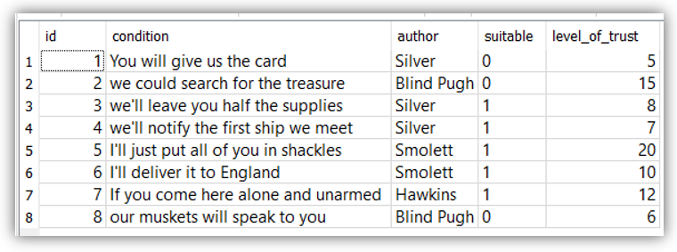

# [E. Переговоры](https://contest.yandex.ru/contest/24953/problems/E/)

**Ограничение времени:** 1 секунда \
**Ограничение памяти:** 64Mb \
**Ввод:** стандартный ввод или input.txt \
**Вывод:** стандартный вывод или output.txt

– Вот наши условия, – наконец нарушил молчание Сильвер. – Вы отдадите нам карту, чтобы мы могли заняться поисками клада. Тогда мы оставим вам половину припасов и первому же встреченному кораблю сообщим, что вы нуждаетесь в помощи. \
– И это все? – осведомился капитан Смоллетт. \
– Это мое последнее слово, будь я проклят! – ответил Джон. – Если вы откажетесь, то с вами будут говорить наши мушкеты. \
– Превосходно, – сказал капитан. – А теперь выслушайте меня. Если вы явитесь сюда поодиночке и без оружия, то я всего лишь закую всех вас в кандалы и доставлю в Англию, где вас будут судить по закону.

Напишите программу, которая выберет условия, на которые можно согласиться.

Вашему решению будет доступен файл базы данных с таблицей `Talks` формата (показана БД для примеров): \
`id, condition, author, suitable, level_of_trust`



## Формат ввода
Вводится имя файла БД, затем два условия отбора, которые должны выполняться одновременно, и поле, по которому происходит сортировка выводимых значений.
Формат вывода

Вывести подходящие условия (`condition`), отсортированные по указанному полю. Каждое с новой строки.


## Пример 1

### Ввод

```
conversations.db
author = 'Silver'
level_of_trust BETWEEN 6 AND 15
id
```

### Вывод

```
we'll leave you half the supplies
we'll notify the first ship we meet
```

## Пример 2

### Ввод

```
discussion.db
suitable = 1
level_of_trust > 10
author
```

### Вывод

```
If you come here alone and unarmed
I'll just put all of you in shackles
```

## Примечания
Файлы из примеров: [conversations.db](conversations.db) и [discussion.db](discussion.db).
Используется СУБД `sqlite`.

Данные необходимо упорядочивать по возрастанию (`ASC`).